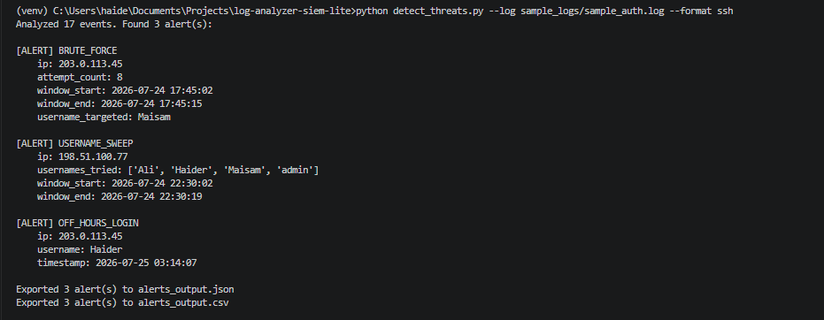
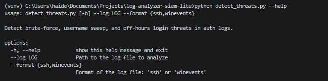
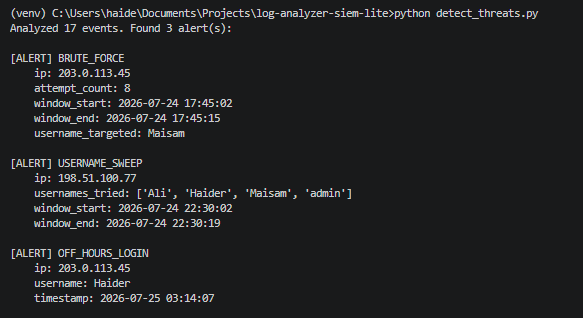
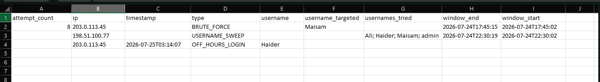

# SIEM-Lite: Log Threat Detector

A lightweight, from-scratch SIEM-style tool that parses authentication logs (SSH and Windows Event Logs), detects common attack patterns, and exports findings for reporting — built to demonstrate core security log analysis concepts without relying on a full SIEM platform.



## Overview

Real SIEM platforms (Splunk, Wazuh, Sentinel, etc.) ingest authentication logs and correlate events to flag suspicious activity. SIEM-Lite implements the same core ideas in plain Python:

- Parses two different log formats into one normalized event structure
- Applies threshold and correlation-based detection rules
- Flags brute-force attacks, username enumeration sweeps, and off-hours logins
- Exports results to JSON and CSV for downstream use
- Runs as a CLI tool against either log format

## Features

- **Dual log format support** — SSH auth logs (line-based) and Windows Event Logs (block-based)
- **Normalized event pipeline** — both parsers output the same event shape, so one detection engine works against either source
- **Three detection rules:**
  - **Brute-force burst** — many failed logins from one IP within a short window
  - **Username sweep** — one IP attempting multiple distinct usernames (account enumeration)
  - **Off-hours login** — successful login outside a defined normal-hours window
- **Sliding window correlation logic** — mirrors how real SIEM rate-based rules work
- **Export to JSON and CSV** — structured output for tooling or spreadsheet review
- **CLI interface** via `argparse` — no hardcoded file paths, run against any log file

## Architecture

```
Log File (SSH or Windows Event Log)
        │
        ▼
   Parser Layer          parse_ssh_log.py / parse_winevents_log.py
   (format-specific)     → normalizes into: {timestamp, username, ip, outcome}
        │
        ▼
   Detection Engine       detect_threats.py
   (format-agnostic)      → brute-force / username sweep / off-hours rules
        │
        ▼
   Export Layer           JSON + CSV output files
```

The key design decision: parsers only handle format-specific parsing and normalization. The detection engine never touches raw log syntax — it only works with the normalized event shape. This means adding a third log format later (e.g., a firewall log) only requires writing a new parser, with zero changes to detection logic.

## Project Structure

```
log-analyzer-siem-lite/
├── detect_threats.py          # Detection engine + CLI entry point
├── parse_ssh_log.py           # SSH auth.log parser
├── parse_winevents_log.py     # Windows Event Log parser
├── sample_logs/
│   ├── sample_auth.log        # Sample SSH log with normal + attack traffic
│   └── sample_winevents.log   # Same scenario in Windows Event Log format
├── screenshots/
│   ├── 01-detection-alerts.png
│   ├── 02-csv-export-output.png
│   ├── 03-cli-help.png
│   └── 04-full-scan-output.png
├── alerts_output.json         # Generated on run
├── alerts_output.csv          # Generated on run
└── README.md
```

## Setup & Installation

**Requirements:** Python 3.10+ (uses modern type-hint-friendly syntax; no external dependencies — everything used is from the Python standard library)

```bash
# Clone the repo
git clone https://github.com/maisamhaider10-create/SIEM-Lite-Log-Threat-Detector.git
cd log-analyzer-siem-lite

# Create and activate a virtual environment
python -m venv venv
venv\Scripts\activate        # Windows
source venv/bin/activate     # macOS/Linux

# No pip install needed — only standard library modules are used
```

## Usage

Run against the sample SSH log:

```bash
python detect_threats.py --log sample_logs/sample_auth.log --format ssh
```

Run against the sample Windows Event Log:

```bash
python detect_threats.py --log sample_logs/sample_winevents.log --format winevents
```

View all options:

```bash
python detect_threats.py --help
```



Each run analyzes the log, prints any alerts to the terminal, and writes `alerts_output.json` and `alerts_output.csv` to the project root.

## Sample Output

Running against `sample_auth.log` (17 events, 3 attack patterns embedded) produces:



- **BRUTE_FORCE** — IP `203.0.113.45` made 8 failed login attempts against `Maisam` within a 13-second window
- **USERNAME_SWEEP** — IP `198.51.100.77` attempted 4 distinct usernames (`Ali`, `Haider`, `Maisam`, `admin`) within a 17-second window
- **OFF_HOURS_LOGIN** — `Haider` logged in successfully at 3:14 AM, outside the defined 6 AM–10 PM normal-hours window

Exported CSV output (union-of-fields, blank cells where a given alert type has no value for that column):



## Detection Logic

| Rule | Signal | Threshold |
|---|---|---|
| Brute-force burst | Failed attempts, same IP, short window | ≥5 attempts within 30s |
| Username sweep | Distinct usernames, same IP, short window | ≥3 usernames within 60s |
| Off-hours login | Successful login outside normal hours | Before 6 AM or after 10 PM |

Detection uses a **sliding time window**: for each failed event, the engine checks how many related events (same IP) fall within the threshold window that follows it. This mirrors how real SIEM correlation rules (e.g., Splunk's `bucket`/time-window searches) implement rate-based detection. One alert is emitted per detected incident to avoid duplicate/near-identical alerts — a basic form of the alert deduplication real SOC tools rely on to reduce alert fatigue.

Thresholds are defined as constants at the top of `detect_threats.py` and can be tuned:

```python
BRUTE_FORCE_MAX_ATTEMPTS = 5
BRUTE_FORCE_WINDOW_SECONDS = 30
SWEEP_MIN_DISTINCT_USERNAMES = 3
SWEEP_WINDOW_SECONDS = 60
OFF_HOURS_START = 6
OFF_HOURS_END = 22
```

## Limitations & Future Improvements

This is a learning/portfolio project, not production security tooling. Known simplifications:

- Off-hours detection uses one fixed window for all users, rather than per-user historical baselines
- No persistent storage — each run is stateless and doesn't track state across multiple log files or sessions
- No real-time log tailing — processes static log files only

Possible next steps:
- Per-user behavioral baselines instead of a single global off-hours window
- A simple web dashboard (Flask) to visualize alerts instead of terminal/CSV only
- Support for additional log formats (firewall, web server access logs)
- Real-time monitoring via log file tailing

## Tech Stack

Python 3 (standard library only: `argparse`, `collections`, `datetime`, `json`, `csv`)