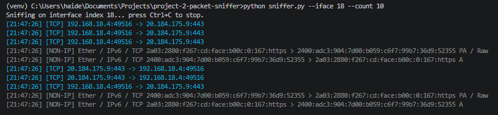
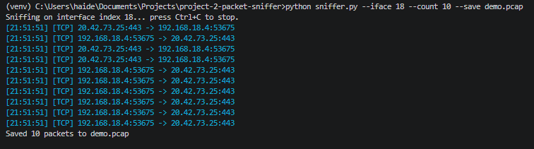
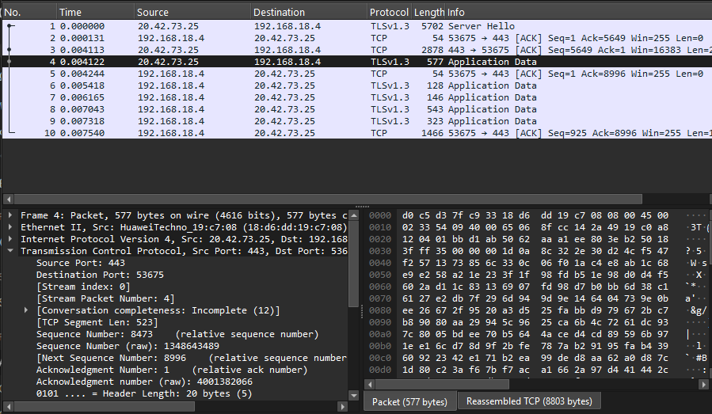

# Packet Sniffer & Analyzer

A lightweight, real-time packet sniffer and analyzer built in Python using Scapy and Npcap. Captures live network traffic, parses protocol layers, and optionally saves captures to standard `.pcap` files for further analysis in tools like Wireshark.

This is my second cybersecurity/networking portfolio project, following a Python network scanner (Project 1).

## Features

- **Live packet capture** on a selected network interface using Scapy + Npcap
- **Layer-by-layer parsing**: identifies IP, TCP, UDP, and ICMP traffic, with source/destination IPs and ports
- **Protocol filtering** via `--proto`, using BPF filters (same filter syntax as tcpdump/Wireshark) for efficient, driver-level filtering
- **Color-coded terminal output** per protocol for easy visual scanning (TCP, UDP, ICMP, and non-IP traffic each get distinct colors)
- **Accurate timestamps** using the packet's own capture time, not print time
- **Full packet accounting**: even non-IP traffic (e.g. ARP) and unrecognized IP protocols are logged, not silently dropped
- **Save to `.pcap`** via `--save`, producing standard capture files fully compatible with Wireshark

## Requirements

- Python 3.x
- [Npcap](https://npcap.com/) installed (required for packet capture on Windows)
- Administrator privileges (required to actually capture packets — installing dependencies does not require admin)

## Setup

```bash
git clone https://github.com/maisamhaider10-create/packet-sniffer-analyzer.git
cd project-2-packet-sniffer
python -m venv venv
venv\Scripts\activate
python -m pip install -r requirements.txt
```

> **Note:** On some Windows systems, plain `pip install` may be blocked by Device Guard policy. If this happens, use `python -m pip install <package>` instead.

## Usage

List available network interfaces:
```bash
python sniffer.py --list-ifaces
```

Capture 10 packets on a specific interface:
```bash
python sniffer.py --iface 18 --count 10
```

Filter for only TCP traffic:
```bash
python sniffer.py --iface 18 --proto tcp
```

Save a capture to a `.pcap` file:
```bash
python sniffer.py --iface 18 --count 10 --save demo.pcap
```

> **Important:** Capturing packets (`sniff()`) requires running your terminal as Administrator. Creating the venv and installing packages does not.

## Demo

**Basic capture, color-coded by protocol:**



**Saving a capture to a `.pcap` file:**



**The same capture opened in Wireshark, confirming full interoperability:**



## Known Limitations

- **IPv6 is not yet parsed.** The script currently only checks Scapy's `IP` class (IPv4), so IPv6 packets fall into the generic `[NON-IP]` branch and are mislabeled rather than properly identified and parsed.
- **No deep protocol dissection.** Traffic like TLS handshakes is only labeled generically as TCP; tools like Wireshark parse further into the TLS layer itself. Adding deeper protocol-aware parsing is a natural next step.

## Future Improvements

- Proper IPv6 support
- Deeper protocol dissection (e.g. TLS handshake detection)
- Optional live statistics/summary view (packet counts per protocol, top talkers, etc.)

## Privacy Note

Captured `.pcap` files are excluded from this repository via `.gitignore`, since they can contain private local network IP/MAC addresses. Only a small demo capture was generated specifically for the screenshots above.